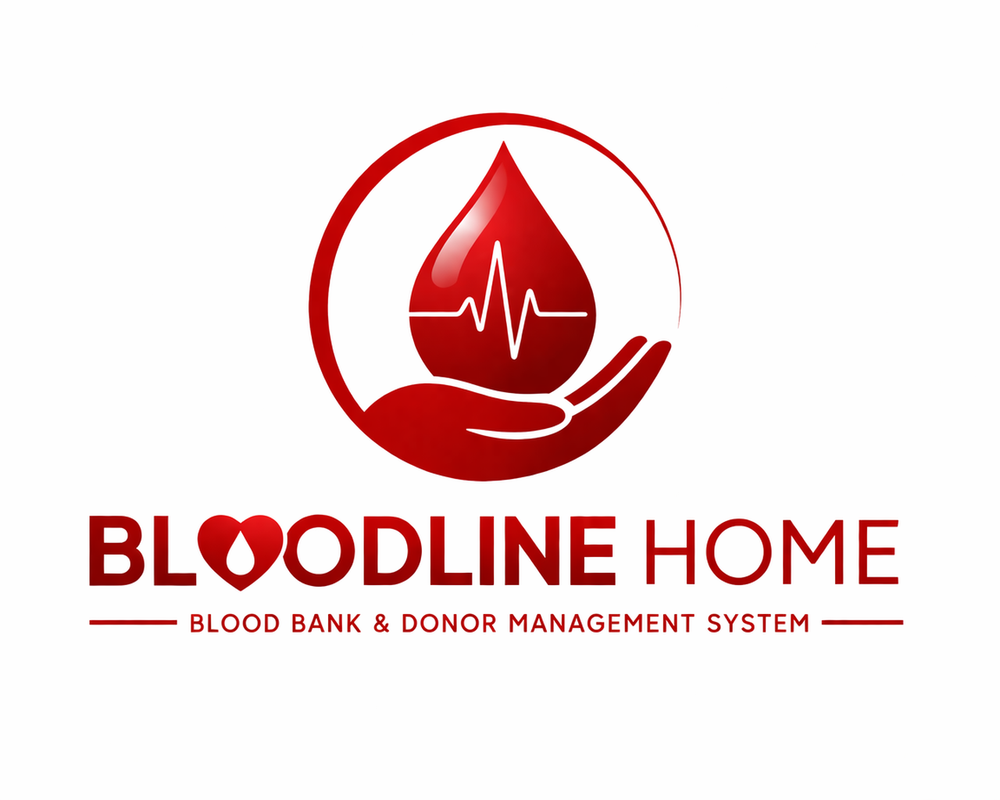

# BloodLine Home - Comprehensive System Report
**Date Generated:** April 18, 2026

---

## Table of Contents
1. [index.php - Landing Page](#indexphp---landing-page)
2. [admin/dashboard.php - Admin Dashboard](#admindashboardphp---admin-dashboard)
3. [admin/appointments.php - Appointment Management](#adminappointmentsphp---appointment-management)
4. [admin/requests.php - Blood Request Management](#adminrequestsphp---blood-request-management)
5. [admin/update-appointment-status.php - Appointment Status Update](#adminupdate-appointment-statusphp---appointment-status-update)
6. [admin/update-request-status.php - Request Status Update](#adminupdate-request-statusphp---request-status-update)

---

## index.php - Landing Page

### Purpose
Main landing page of BloodLine Home - a comprehensive blood donation and management system. Serves as the public-facing homepage with information about the blood bank and its features.

### Full Code
```html
<!DOCTYPE html>
<html lang="en">
<head>
  <meta charset="UTF-8" />
  <meta name="viewport" content="width=device-width, initial-scale=1.0"/>
  <title>BloodLine Home</title>

  <!-- fonts from google -->
  <link href="https://fonts.googleapis.com/css2?family=DM+Sans:wght@400;500;600;700&family=DM+Serif+Display&display=swap" rel="stylesheet"/>
  
  <!-- Font Awesome Icons -->
  <link rel="stylesheet" href="https://cdnjs.cloudflare.com/ajax/libs/font-awesome/6.4.0/css/all.min.css"/>
  
  <!-- styles -->
  <link rel="stylesheet" href="assets/css/index.css"/>
</head>
<body>

<!-- HEADER -->

<nav>
  <a href="index.php" class="nav-brand">
    <div class="nav-logo-icon">
      
    </div>
    <div class="nav-brand-text">
      <div class="nav-brand-name">BloodLine Home</div>
      <div class="nav-brand-tagline">Saving Lives Together</div>
    </div>
  </a>
  <div class="nav-actions">
    <a href="login.php" class="btn-link">Login</a>
    <a href="register.php" class="btn-primary">Register</a>
  </div>
</nav>

<!-- HERO SECTION -->

<div class="hero">
  <video class="hero-video" autoplay muted loop>
    <source src="assets/video/Blood Donar.mp4" type="video/mp4">
    Your browser does not support the video tag.
  </video>
  <div class="hero-icon-wrap">
    <svg viewBox="0 0 24 24" xmlns="http://www.w3.org/2000/svg">
      <path d="M12 21.593c-5.63-5.539-11-10.297-11-14.402 0-3.791 3.068-5.191
               5.281-5.191 1.312 0 4.151.501 5.719 4.457 1.59-3.968 4.464-4.447
               5.726-4.447 2.54 0 5.274 1.621 5.274 5.181 0 4.069-5.136
               8.625-11 14.402z"/>
    </svg>
  </div>
  <h1>Welcome to BloodLine Home</h1>
  <p>A comprehensive blood donation and management system connecting donors with
     patients in need. Every drop counts in saving lives.</p>
  <div class="hero-btns">
    <a href="#" class="btn-primary">Become a Donor</a>
    <a href="#" class="btn-outline">Learn More</a>
  </div>
</div>

<!-- ABOUT SECTION -->

<section class="about">
  <h2 class="section-title">About Our Blood Bank</h2>
  <div class="about-grid">

    <!-- mission card -->
    <div class="about-card">
      <div class="about-icon blue">
        <svg viewBox="0 0 24 24" fill="none" stroke="#3b82f6" stroke-width="2"
             stroke-linecap="round" stroke-linejoin="round">
          <path d="M17 21v-2a4 4 0 0 0-4-4H5a4 4 0 0 0-4 4v2"/>
          <circle cx="9" cy="7" r="4"/>
          <path d="M23 21v-2a4 4 0 0 0-3-3.87"/>
          <path d="M16 3.13a4 4 0 0 1 0 7.75"/>
        </svg>
      </div>
      <h3>Our Mission</h3>
      <p>To provide a safe, reliable, and efficient blood donation and distribution
         system that saves lives and serves our community with excellence.</p>
    </div>

    <!-- safety card -->
    <div class="about-card">
      <div class="about-icon green">
        <svg viewBox="0 0 24 24" fill="none" stroke="#22c55e" stroke-width="2"
             stroke-linecap="round" stroke-linejoin="round">
          <path d="M12 22s8-4 8-10V5l-8-3-8 3v7c0 6 8 10 8 10z"/>
          <polyline points="9 12 11 14 15 10"/>
        </svg>
      </div>
      <h3>Safety First</h3>
      <p>All donated blood undergoes rigorous testing and screening to ensure
         the highest standards of safety for both donors and recipients.</p>
    </div>

    <!-- 24/7 card -->
    <div class="about-card">
      <div class="about-icon pink">
        <svg viewBox="0 0 24 24" fill="none" stroke="#e0002b" stroke-width="2"
             stroke-linecap="round" stroke-linejoin="round">
          <circle cx="12" cy="12" r="10"/>
          <polyline points="12 6 12 12 16 14"/>
        </svg>
      </div>
      <h3>24/7 Availability</h3>
      <p>Our blood bank operates round the clock to ensure that life-saving blood
         is available whenever and wherever it's needed.</p>
    </div>

  </div>
</section>

<!-- FEATURES SECTION -->

<section class="features">
  <h2 class="section-title">Key Features</h2>
  <div class="features-grid">

    <!-- registration feature -->
    <div class="feature-card">
      <div class="feature-icon red">
        <i class="fas fa-user"></i>
      </div>
      <div>
        <h4>Easy Registration</h4>
        <p>Quick and simple registration process for donors. Provide basic
           information, medical history, and you're ready to start saving lives.</p>
      </div>
    </div>

    <!-- appointments feature -->
    <div class="feature-card">
      <div class="feature-icon blue">
        <i class="fas fa-calendar-days"></i>
      </div>
      <div>
        <h4>Appointment Booking</h4>
        <p>Schedule donation appointments at your convenience. Request blood
           for patients with flexible scheduling options.</p>
      </div>
    </div>

    <!-- inventory feature -->
    <div class="feature-card">
      <div class="feature-icon green">
        <i class="fas fa-box-open"></i>
      </div>
      <div>
        <h4>Smart Inventory Management</h4>
        <p>FIFO-based inventory system ensures proper blood usage. Special
           tracking for rare blood groups to prevent wastage.</p>
      </div>
    </div>

    <!-- rare blood groups feature -->
    <div class="feature-card">
      <div class="feature-icon purple">
        <i class="fas fa-vials"></i>
      </div>
      <div>
        <h4>Rare Blood Group Support</h4>
        <p>Special handling for rare blood groups with frozen storage. Requests
           are stored and processed when inventory becomes available.</p>
      </div>
    </div>

    <!-- stock alerts feature -->
    <div class="feature-card">
      <div class="feature-icon yellow">
        <i class="fas fa-bell"></i>
      </div>
      <div>
        <h4>Low Stock Alerts</h4>
        <p>Automatic alerts when blood inventory falls below critical levels.
           Expiry date tracking to minimize waste.</p>
      </div>
    </div>

    <!-- admin feature -->
    <div class="feature-card">
      <div class="feature-icon teal">
        <i class="fas fa-shield-halved"></i>
      </div>
      <div>
        <h4>Admin Approval System</h4>
        <p>Secure admin dashboard to review and approve donation and request
           appointments. Complete user and inventory management.</p>
      </div>
    </div>

  </div>
</section>

<!-- WHY DONATE SECTION -->

<section class="why">
  <h2 class="section-title">Why Donate Blood?</h2>
  <div class="why-list">
```

### Analysis
- **Type:** Public landing page (HTML/CSS only)
- **Key Sections:** Hero, About, Features, Why Donate
- **Assets Used:** Google Fonts, Font Awesome, Custom CSS
- **Features Highlighted:**
  - Easy Registration
  - Appointment Booking
  - Smart Inventory Management
  - Rare Blood Group Support
  - Low Stock Alerts
  - Admin Approval System
- **Navigation:** Login and Register links
- **Design Pattern:** Card-based grid layout with SVG icons

---

## admin/dashboard.php - Admin Dashboard

### Purpose
Main administrative dashboard displaying key metrics and recent blood requests. Provides overview of system status including donor count, available blood units, pending requests, and urgent requests.

### Full Code
```php
<?php
include("../config/admin-session.php");
include("../config/db.php");
include("../includes/functions.php");

// Total Donors
$stmt = $conn->prepare("SELECT COUNT(*) as total FROM users WHERE role='user'");
$stmt->execute();
$totalDonors = $stmt->get_result()->fetch_assoc()['total'] ?? 0;
$stmt->close();

// Available Units
$stmt = $conn->prepare("SELECT COUNT(*) as total FROM blood_inventory WHERE LOWER(status)='available'");
$stmt->execute();
$availableUnits = $stmt->get_result()->fetch_assoc()['total'] ?? 0;
$stmt->close();

// Pending Requests
$stmt = $conn->prepare("SELECT COUNT(*) as total FROM blood_requests WHERE LOWER(status)='pending'");
$stmt->execute();
$pendingRequests = $stmt->get_result()->fetch_assoc()['total'] ?? 0;
$stmt->close();

// Urgent Requests
$stmt = $conn->prepare("SELECT COUNT(*) as total FROM blood_requests WHERE LOWER(urgency)='urgent'");
$stmt->execute();
$urgentRequests = $stmt->get_result()->fetch_assoc()['total'] ?? 0;
$stmt->close();

// Rare Units
$stmt = $conn->prepare("
    SELECT COUNT(*) as total 
    FROM blood_inventory 
    WHERE blood_type IN ('A2-', 'A2B-', 'Bombay (Oh)', 'Rh-null') AND LOWER(status)='available'
");
$stmt->execute();
$rareUnits = $stmt->get_result()->fetch_assoc()['total'] ?? 0;
$stmt->close();

// Recent Requests
$stmt = $conn->prepare("SELECT * FROM blood_requests ORDER BY id DESC LIMIT 5");
$stmt->execute();
$recentRequests = $stmt->get_result();
?>
<!DOCTYPE html>
<html lang="en">
<head>
    <meta charset="UTF-8">
    <title>Admin Dashboard</title>
    <link rel="stylesheet" href="../assets/css/style.css">
    <link rel="stylesheet" href="../assets/css/dashboard.css">
    <script src="https://unpkg.com/@phosphor-icons/web"></script>
    <script src="https://unpkg.com/phosphor-icons"></script>
</head>
<body>
<div class="dashboard-layout">
    <?php include("../includes/sidebar-admin.php"); ?>

    <div class="main-panel">
        <div class="topbar"><div class="menu-btn">≡</div></div>
        <h1 class="page-title">Dashboard</h1>

        <h2>Total Number</h2>
        <div class="stats-row">
            <div class="stat-card"><div><h4>Donors</h4><p><?php echo (int)$totalDonors; ?></p></div><i class="ph-thin ph-users" style="color:#940404;font-size:52px;"></i></div>
            <div class="stat-card"><div><h4>Available blood units</h4><p><?php echo (int)$availableUnits; ?></p></div><i class="ph-thin ph-drop" style="color:#940404;font-size:52px;"></i></div>
            <div class="stat-card"><div><h4>Pending requests</h4><p><?php echo (int)$pendingRequests; ?></p></div><i class="ph-thin ph-clipboard" style="color:#940404;font-size:52px;"></i></div>
            <div class="stat-card"><div><h4>Urgent</h4><p><?php echo (int)$urgentRequests; ?></p></div><i class="ph-thin ph-warning" style="color:#940404;font-size:52px;"></i></div>
        </div>

        <h2>Recent Blood Requests</h2>
        <div class="table-box">
            <table>
                <thead>
                    <tr>
                        <th>Request ID</th>
                        <th>Hospital</th>
                        <th>Blood Type</th>
                        <th>Units</th>
                        <th>Urgency</th>
                        <th>Status</th>
                    </tr>
                </thead>
                <tbody>
                    <?php if ($recentRequests && $recentRequests->num_rows > 0): ?>
                        <?php while($row = $recentRequests->fetch_assoc()): ?>
                        <tr>
                            <td><?php echo htmlspecialchars(preg_replace('/^RID/', 'RID ', $row['request_id'])); ?></td>
                            <td>Bir Hospital</td>
                            <td>
                                <span class="<?php echo getBloodGroupBadgeClass($row['blood_type']); ?>">
                                    <?php echo htmlspecialchars($row['blood_type']); ?>
                                </span>
                            </td>
                            <td><?php echo htmlspecialchars($row['units']); ?></td>
                            <td>
                                <span class="<?php echo strtolower($row['urgency']) === 'urgent' ? 'badge badge-red' : 'badge badge-blue'; ?>">
                                    <?php echo htmlspecialchars($row['urgency']); ?>
                                </span>
                            </td>
                            <td>
                                <span class="<?php echo getStatusBadge($row['status']); ?>">
                                    <?php echo htmlspecialchars($row['status']); ?>
                                </span>
                            </td>
                        </tr>
                        <?php endwhile; ?>
                    <?php else: ?>
                        <tr><td colspan="6">No recent requests found.</td></tr>
                    <?php endif; ?>
                </tbody>
            </table>
        </div>
    </div>
</div>
<script src="../assets/js/dashboard.js"></script>
</body>
</html>
```

### Key Features
- **Metrics Displayed:**
  - Total Donors
  - Available Blood Units
  - Pending Requests
  - Urgent Requests
  - Rare Blood Units (A2-, A2B-, Bombay (Oh), Rh-null)
- **Database Queries:** 6 prepared statements for data retrieval
- **Recent Requests:** Displays last 5 requests with details
- **UI Elements:** Stat cards with Phosphor icons, data table with badges
- **Security:** Uses prepared statements to prevent SQL injection

### Database Tables Accessed
- `users` (role='user' for donors)
- `blood_inventory` (status='available')
- `blood_requests` (status, urgency filtering)

---

## admin/appointments.php - Appointment Management

### Purpose
Admin interface for managing blood donation appointments. Allows filtering by status, date, blood group, and search terms. Displays all appointments with action buttons to confirm or cancel pending appointments.

### Full Code
```php
<?php
include("../config/admin-session.php");
include("../config/db.php");
include("../includes/functions.php");
require_once("../includes/security.php");

$statusFilter = trim($_GET['status'] ?? '');
$dateFilter = trim($_GET['date'] ?? '');
$search = trim($_GET['search'] ?? '');
$bloodFilter = trim($_GET['blood_group'] ?? '');

$sql = "
    SELECT appointments.*, users.full_name, users.blood_group
    FROM appointments
    LEFT JOIN users ON appointments.user_id = users.id
    WHERE 1=1
";
$params = [];
$types = '';

if ($statusFilter !== '') {
    $sql .= " AND appointments.status = ? ";
    $params[] = $statusFilter;
    $types .= 's';
}

if ($dateFilter !== '') {
    $sql .= " AND appointments.appointment_date = ? ";
    $params[] = $dateFilter;
    $types .= 's';
}

if ($bloodFilter !== '') {
    $sql .= " AND users.blood_group = ? ";
    $params[] = $bloodFilter;
    $types .= 's';
}

if ($search !== '') {
    $sql .= " AND (users.full_name LIKE ? OR appointments.location LIKE ? OR appointments.id LIKE ?) ";
    $like = "%{$search}%";
    $params[] = $like;
    $params[] = $like;
    $params[] = $like;
    $types .= 'sss';
}

$sql .= " ORDER BY appointments.appointment_date DESC, appointments.appointment_time ASC";

$stmt = $conn->prepare($sql);
if (!empty($params)) {
    $stmt->bind_param($types, ...$params);
}
$stmt->execute();
$appointments = $stmt->get_result();

$today = date('Y-m-d');

// Total Today
$stmt1 = $conn->prepare("SELECT COUNT(*) as total FROM appointments WHERE appointment_date=?");
$stmt1->bind_param("s", $today);
$stmt1->execute();
$totalToday = $stmt1->get_result()->fetch_assoc()['total'] ?? 0;
$stmt1->close();

// Confirmed
$stmt2 = $conn->prepare("SELECT COUNT(*) as total FROM appointments WHERE status='confirmed'");
$stmt2->execute();
$confirmed = $stmt2->get_result()->fetch_assoc()['total'] ?? 0;
$stmt2->close();

// Pending
$stmt3 = $conn->prepare("SELECT COUNT(*) as total FROM appointments WHERE status='pending'");
$stmt3->execute();
$pending = $stmt3->get_result()->fetch_assoc()['total'] ?? 0;
$stmt3->close();

// Cancelled
$stmt4 = $conn->prepare("SELECT COUNT(*) as total FROM appointments WHERE status='cancelled'");
$stmt4->execute();
$cancelled = $stmt4->get_result()->fetch_assoc()['total'] ?? 0;
$stmt4->close();
?>
<!DOCTYPE html>
<html lang="en">
<head>
    <meta charset="UTF-8">
    <title>Appointments</title>
    <link rel="stylesheet" href="../assets/css/style.css">
    <link rel="stylesheet" href="../assets/css/dashboard.css">
    <script src="https://unpkg.com/phosphor-icons"></script>
</head>
</head>
<body>
<div class="dashboard-layout">
    <?php include("../includes/sidebar-admin.php"); ?>
    <div class="main-panel">
        <div class="topbar"><div class="menu-btn">≡</div></div>
        <h1 class="page-title">Appointment</h1>

        <h2 style="font-weight:normal;">Total Numbers</h2>
        <div class="stats-row" style="margin-bottom:30px;">
            <div class="stat-card"><div><h4>Today</h4><p><?php echo (int)$totalToday; ?></p></div><i class="ph-thin ph-calendar-plus" style="color:#940404;font-size:52px;"></i></div>
            <div class="stat-card"><div><h4>Confirmed</h4><p><?php echo (int)$confirmed; ?></p></div><i class="ph-thin ph-check-circle-fill" style="color:#940404;font-size:52px;"></i></div>
            <div class="stat-card"><div><h4>Pending</h4><p><?php echo (int)$pending; ?></p></div><i class="ph-thin ph-clipboard" style="color:#940404;font-size:52px;"></i></div>
            <div class="stat-card"><div><h4>Cancelled</h4><p><?php echo (int)$cancelled; ?></p></div><i class="ph-thin ph-prohibit" style="color:#940404;font-size:52px;"></i></div>
        </div>

        <div class="filter-box">
            <h3>Filter</h3>
            <form method="GET" class="filter-row">
                <input type="text" name="search" placeholder="name & ID" value="<?php echo htmlspecialchars($search); ?>">
                <input type="date" name="date" placeholder="Date" value="<?php echo htmlspecialchars($dateFilter); ?>">
                <select name="blood_group">
                    <option value="">Blood group</option>
                    <?php foreach (getBloodGroups() as $group): ?>
                        <option value="<?php echo htmlspecialchars($group); ?>"><?php echo htmlspecialchars($group); ?></option>
                    <?php endforeach; ?>
                </select>
                <select name="status">
                    <option value="">Status</option>
                    <option value="pending" <?php if($statusFilter==='pending') echo 'selected'; ?>>Pending</option>
                    <option value="confirmed" <?php if($statusFilter==='confirmed') echo 'selected'; ?>>Confirmed</option>
                    <option value="cancelled" <?php if($statusFilter==='cancelled') echo 'selected'; ?>>Cancelled</option>
                </select>
                <button class="btn" type="submit" style="background:#666;color:white;">Clear</button>
            </form>
        </div>

        <h2>Appointment List</h2>
        <div class="table-box">
            <table>
                <thead>
                    <tr>
                        <th>Appointment ID</th>
                        <th>Location</th>
                        <th>Blood Type</th>
                        <th>Time</th>
                        <th>Date</th>
                        <th>Action</th>
                    </tr>
                </thead>
                <tbody>
                    <?php while($row = $appointments->fetch_assoc()): ?>
                        <tr>
                            <td>AID <?php echo (int)$row['id']; ?></td>
                            <td><?php echo htmlspecialchars($row['location']); ?></td>
                            <td><?php echo htmlspecialchars($row['blood_group']); ?></td>
                            <td><?php echo htmlspecialchars($row['appointment_time']); ?></td>
                            <td><?php echo htmlspecialchars($row['appointment_date']); ?></td>
                            <td>
                                <?php if ($row['status'] === 'pending'): ?>

                                    <form method="POST" action="update-appointment-status.php" style="display:inline;">
                                        <?php echo csrfField(); ?>
                                        <input type="hidden" name="id" value="<?php echo (int)$row['id']; ?>">
                                        <input type="hidden" name="status" value="confirmed">
                                        <button class="btn" type="submit" style="background:#d4a574;color:white;padding:6px 16px;border:none;border-radius:4px;cursor:pointer;font-weight:600;">Confirm</button>
                                    </form>

                                    <form method="POST" action="update-appointment-status.php" style="display:inline;margin-left:8px;">
                                        <?php echo csrfField(); ?>
                                        <input type="hidden" name="id" value="<?php echo (int)$row['id']; ?>">
                                        <input type="hidden" name="status" value="cancelled">
                                        <button class="btn" type="submit" style="background:#dc3545;color:white;padding:6px 16px;border:none;border-radius:4px;cursor:pointer;font-weight:600;">Cancel</button>
                                    </form>

                                <?php else: ?>
                                    <span>-</span>
                                <?php endif; ?>
                            </td>
                        </tr>
                    <?php endwhile; ?>
                </tbody>
            </table>
        </div>

    </div>
</div>
</body>
</html>
```

### Key Features
- **Filtering Options:**
  - Search (by donor name, ID, location)
  - Date Filter
  - Blood Group Filter
  - Status Filter (Pending, Confirmed, Cancelled)
- **Statistics Displayed:**
  - Total appointments today
  - Total confirmed appointments
  - Total pending appointments
  - Total cancelled appointments
- **Actions:** 
  - Confirm pending appointments
  - Cancel pending appointments
- **Security:** CSRF protection via `csrfField()`
- **Database:** Uses LEFT JOIN to get user information

### Database Tables
- `appointments`
- `users`

---

## admin/requests.php - Blood Request Management

### Purpose
Administrative interface for managing blood requests from hospitals/patients. Allows filtering and displays detailed request information with action buttons to approve, reject, or request donors.

### Full Code
```php
<?php
include("../config/admin-session.php");
include("../config/db.php");
include("../includes/functions.php");
require_once("../includes/security.php");

$search = trim($_GET['search'] ?? '');
$location = trim($_GET['location'] ?? '');
$blood_group = trim($_GET['blood_group'] ?? '');
$status = trim($_GET['status'] ?? '');

$sql = "SELECT br.*, u.full_name as requester_name FROM blood_requests br LEFT JOIN users u ON br.user_id = u.id WHERE 1=1";
$params = [];
$types = '';

if ($search !== '') {
    $sql .= " AND (hospital_name LIKE ? OR request_id LIKE ? OR contact LIKE ?)";
    $like = "%{$search}%";
    $params[] = $like;
    $params[] = $like;
    $params[] = $like;
    $types .= 'sss';
}

if ($location !== '') {
    $sql .= " AND location LIKE ?";
    $params[] = "%{$location}%";
    $types .= 's';
}

if ($blood_group !== '') {
    $sql .= " AND blood_type = ?";
    $params[] = $blood_group;
    $types .= 's';
}

if ($status !== '') {
    $sql .= " AND LOWER(status) = LOWER(?)";
    $params[] = $status;
    $types .= 's';
}

$sql .= " ORDER BY id DESC";

$stmt = $conn->prepare($sql);
if (!empty($params)) {
    $stmt->bind_param($types, ...$params);
}
$stmt->execute();
$requests = $stmt->get_result();

// Rejected Requests
$stmt_rejected = $conn->prepare("SELECT COUNT(*) total FROM blood_requests WHERE LOWER(status)='rejected'");
$stmt_rejected->execute();
$rejectedCount = $stmt_rejected->get_result()->fetch_assoc()['total'] ?? 0;
$stmt_rejected->close();

// Pending Requests
$stmt_pending = $conn->prepare("SELECT COUNT(*) total FROM blood_requests WHERE LOWER(status)='pending'");
$stmt_pending->execute();
$pendingCount = $stmt_pending->get_result()->fetch_assoc()['total'] ?? 0;
$stmt_pending->close();

// Approved Requests
$stmt_appr = $conn->prepare("SELECT COUNT(*) total FROM blood_requests WHERE LOWER(status)='approved'");
$stmt_appr->execute();
$approvedCount = $stmt_appr->get_result()->fetch_assoc()['total'] ?? 0;
$stmt_appr->close();

// Urgent Requests
$stmt_urgent = $conn->prepare("SELECT COUNT(*) total FROM blood_requests WHERE LOWER(urgency)='urgent'");
$stmt_urgent->execute();
$urgentCount = $stmt_urgent->get_result()->fetch_assoc()['total'] ?? 0;
$stmt_urgent->close();
?>
<!DOCTYPE html>
<html lang="en">
<head>
    <meta charset="UTF-8">
    <title>Blood Requests</title>
    <link rel="stylesheet" href="../assets/css/style.css">
    <link rel="stylesheet" href="../assets/css/dashboard.css">
    <script src="https://unpkg.com/@phosphor-icons/web"></script>
    <script src="https://unpkg.com/phosphor-icons"></script>
</head>
<body>
<div class="dashboard-layout">
    <?php include("../includes/sidebar-admin.php"); ?>

    <div class="main-panel">
        <div class="topbar"><div class="menu-btn">≡</div></div>
        <h1 class="page-title">Request</h1>

        <div class="filter-box">
            <h3>Filter</h3>
            <form method="GET" class="filter-row">
                <input type="text" name="search" placeholder="name & ID" value="<?php echo htmlspecialchars($search); ?>">
                <input type="text" name="location" placeholder="location" value="<?php echo htmlspecialchars($location); ?>">
                <select name="blood_group">
                    <option value="">Blood group</option>
                    <?php foreach (getBloodGroups() as $group): ?>
                        <option value="<?php echo htmlspecialchars($group); ?>" <?php if($blood_group === $group) echo 'selected'; ?>>
                            <?php echo htmlspecialchars($group); ?>
                        </option>
                    <?php endforeach; ?>
                </select>
                <select name="status">
                    <option value="">Status</option>
                    <option value="rejected" <?php if($status==='rejected') echo 'selected'; ?>>Rejected</option>
                    <option value="pending" <?php if($status==='pending') echo 'selected'; ?>>Pending</option>
                    <option value="approved" <?php if($status==='approved') echo 'selected'; ?>>Approved</option>
                </select>
                <button type="submit">Apply</button>
            </form>
        </div>

        <h2 style="font-weight:normal;">Total Numbers</h2>
        <div class="stats-row" style="margin-bottom:30px;">
            <div class="stat-card"><div><h4>Rejected</h4><p><?php echo (int)$rejectedCount; ?></p></div><i class="ph-thin ph-list" style="color:#940404;font-size:52px;"></i></div>
            <div class="stat-card"><div><h4>Pending</h4><p><?php echo (int)$pendingCount; ?></p></div><i class="ph-thin ph-clipboard" style="color:#940404;font-size:52px;"></i></div>
            <div class="stat-card"><div><h4>Approved</h4><p><?php echo (int)$approvedCount; ?></p></div><i class="ph-thin ph-check-circle-fill" style="color:#940404;font-size:52px;"></i></div>
            <div class="stat-card"><div><h4>Urgent</h4><p><?php echo (int)$urgentCount; ?></p></div><i class="ph-thin ph-warning" style="color:#940404;font-size:52px;"></i></div>
        </div>

        <h2>Request List</h2>
        <div style="display:flex;flex-direction:column;gap:20px;">
            <?php if ($requests->num_rows > 0): ?>
                <?php while($row = $requests->fetch_assoc()): ?>
                <div class="list-card" style="padding:25px;">
                    <div style="display:flex;justify-content:space-between;align-items:flex-start;margin-bottom:20px;">
                        <div style="flex:1;">
                            <h3 style="margin:0;font-size:18px;display:inline;margin-right:15px;">RID: <?php echo (int)substr($row['request_id'], 3, 3); ?></h3>
                            <span class="<?php echo strtolower($row['urgency']) === 'urgent' ? 'badge badge-red' : 'badge badge-blue'; ?>" style="display:inline-block;margin-right:10px;">
                                <?php echo htmlspecialchars($row['urgency']); ?>
                            </span>
                            <span style="display:inline-block;background:#f5dcc8;color:#8b6f47;padding:6px 16px;border-radius:20px;font-weight:700;font-size:14px;">
                                <?php if($row['status'] === 'pending'): ?><i class="ph-thin ph-clipboard" style="margin-right:6px;font-size:16px;"></i><?php endif; ?>
                                <?php echo htmlspecialchars(ucfirst($row['status'])); ?>
                            </span>
                        </div>
                        <div style="text-align:right;display:flex;gap:50px;align-items:center;">
                            <div>
                                <p style="margin:0;font-size:13px;color:#666;">Blood Type</p>
                                <p style="margin:3px 0 0 0;font-size:16px;font-weight:700;"><?php echo htmlspecialchars($row['blood_type']); ?></p>
                            </div>
                            <div>
                                <p style="margin:0;font-size:13px;color:#666;">Units</p>
                                <p style="margin:3px 0 0 0;font-size:16px;font-weight:700;"><?php echo (int)$row['units']; ?></p>
                            </div>
                        </div>
                    </div>

                    <div style="display:grid;grid-template-columns:1fr 1.5fr;gap:40px;margin-bottom:20px;font-size:14px;">
                        <div>
                            <p style="margin:0;"><span style="color:#666;">Name:</span> <?php echo htmlspecialchars($row['requester_name'] ?: 'Unknown'); ?></p>
                            <p style="margin:8px 0 0 0;"><span style="color:#666;">Contact:</span> <?php echo htmlspecialchars($row['contact']); ?></p>
                            <p style="margin:8px 0 0 0;"><span style="color:#666;">Location:</span> <?php echo htmlspecialchars($row['location']); ?></p>
                        </div>
                        <div>
                            <p style="margin:0;"><span style="color:#666;">Request Date:</span> <?php echo htmlspecialchars($row['request_date']); ?></p>
                            <p style="margin:8px 0 0 0;"><span style="color:#666;">Required By:</span> <?php echo htmlspecialchars($row['required_by']); ?></p>
                        </div>
                    </div>

                    <div style="display:flex;gap:15px;margin-bottom:15px;">
                        <form method="POST" action="update-request-status.php" style="flex:1;">
                            <?php echo csrfField(); ?>
                            <input type="hidden" name="id" value="<?php echo (int)$row['id']; ?>">
                            <input type="hidden" name="status" value="approved">
                            <button type="submit" style="background:#28a745;color:white;padding:12px 0;border:none;border-radius:6px;cursor:pointer;font-weight:700;width:100%;">Approve</button>
                        </form>
                        <form method="POST" action="update-request-status.php" style="flex:1;">
                            <?php echo csrfField(); ?>
                            <input type="hidden" name="id" value="<?php echo (int)$row['id']; ?>">
                            <input type="hidden" name="status" value="rejected">
                            <button type="submit" style="background:#dc3545;color:white;padding:12px 0;border:none;border-radius:6px;cursor:pointer;font-weight:700;width:100%;">Reject</button>
                        </form>
                        <form method="POST" action="request-donor.php" style="flex:1;">
                            <?php echo csrfField(); ?>
                            <input type="hidden" name="id" value="<?php echo (int)$row['id']; ?>">
                            <button type="submit" style="flex:1;background:#d89366;color:white;padding:12px 0;border:none;border-radius:6px;cursor:pointer;font-weight:700;text-align:center;width:100%;">Request Donor</button>
                        </form>
                    </div>

                    <?php if (isset($_GET['action'])): ?>
                        <?php if ($_GET['action'] === 'approved'): ?>
                            <div class="notice-box notice-success">Request approved successfully.</div>
                        <?php elseif ($_GET['action'] === 'rejected'): ?>
                            <div class="notice-box notice-success">Request rejected successfully.</div>
                        <?php elseif ($_GET['action'] === 'donor_requested'): ?>
                            <div class="notice-box notice-success">Donor request sent successfully.</div>
                        <?php endif; ?>
                    <?php endif; ?>
                </div>
                <?php endwhile; ?>
            <?php else: ?>
                <div class="list-card" style="text-align:center;padding:40px;">No requests found.</div>
            <?php endif; ?>
        </div>
    </div>
```

### Key Features
- **Filtering Options:**
  - Search (hospital name, request ID, contact)
  - Location filter
  - Blood group filter
  - Status filter (Rejected, Pending, Approved)
- **Statistics:**
  - Rejected count
  - Pending count
  - Approved count
  - Urgent count
- **Card-based Layout:** Each request displayed as detailed card with:
  - Request ID
  - Urgency badge
  - Status badge
  - Blood type and units
  - Requester details
  - Request and required dates
- **Actions:**
  - Approve request
  - Reject request
  - Request donor
- **Security:** CSRF protection

---

## admin/update-appointment-status.php - Appointment Status Update

### Purpose
Backend script for updating appointment status. Handles POST requests to change appointment status from pending to confirmed or cancelled. Includes CSRF protection and input validation.

### Full Code
```php
<?php
include("../config/admin-session.php");
include("../config/db.php");
require_once("../includes/security.php");

verifyCsrf();

$id = (int)($_POST['id'] ?? 0);
$status = trim($_POST['status'] ?? '');

$allowed = ['pending', 'confirmed', 'cancelled'];

if ($id <= 0 || !in_array($status, $allowed, true)) {
    exit("Invalid request.");
}

$stmt = $conn->prepare("UPDATE appointments SET status = ? WHERE id = ?");
$stmt->bind_param("si", $status, $id);

if ($stmt->execute()) {
    header("Location: appointments.php");
    exit();
}

exit("Failed to update appointment.");
?>
```

### Analysis
- **Security Measures:**
  - CSRF token verification via `verifyCsrf()`
  - Admin session requirement
  - Integer casting for ID (prevents SQL injection)
  - Whitelist validation for status values
  - Prepared statements with type binding

- **Validation:**
  - ID must be > 0
  - Status must be one of: `pending`, `confirmed`, `cancelled`
  - Uses strict type checking (`strict=true`)

- **Error Handling:**
  - Invalid request: exits with "Invalid request."
  - Update failure: exits with "Failed to update appointment."
  - Success: redirects to appointments.php

- **Database Operation:**
  - Prepared statement prevents SQL injection
  - Type binding: "si" = string (status), integer (id)
  - Single query execution

---

## admin/update-request-status.php - Request Status Update

### Purpose
Backend script for updating blood request status. Handles POST requests to approve, reject, or complete blood requests with CSRF protection and input validation.

### Full Code
```php
<?php
include("../config/admin-session.php");
include("../config/db.php");
require_once("../includes/security.php");

verifyCsrf();

$id = (int)($_POST['id'] ?? 0);
$status = trim($_POST['status'] ?? '');
$action = trim($_POST['action'] ?? 'update');

$allowed = ['pending', 'approved', 'rejected', 'completed'];

if ($id <= 0 || !in_array($status, $allowed, true)) {
    exit("Invalid request.");
}

$stmt = $conn->prepare("UPDATE blood_requests SET status = ? WHERE id = ?");
$stmt->bind_param("si", $status, $id);

if ($stmt->execute()) {
    if ($status === 'approved') {
        header("Location: requests.php?action=approved");
    } elseif ($status === 'rejected') {
        header("Location: requests.php?action=rejected");
    } else {
        header("Location: requests.php?action=updated");
    }
    exit();
}

exit("Failed to update request status.");
?>
```

### Analysis
- **Security Measures:**
  - CSRF token verification via `verifyCsrf()`
  - Admin session requirement
  - Integer casting for ID
  - Whitelist validation for status values
  - Prepared statements with type binding

- **Validation:**
  - ID must be > 0
  - Status must be one of: `pending`, `approved`, `rejected`, `completed`
  - Strict type checking

- **Status Handling:**
  - **Approved:** Redirects with `?action=approved` parameter
  - **Rejected:** Redirects with `?action=rejected` parameter
  - **Other:** Redirects with `?action=updated` parameter
  - Allows displaying success messages

- **Database Operation:**
  - Updates `blood_requests` table
  - Type binding: "si" = string (status), integer (id)

---

## System Summary

### Architecture Overview
- **Frontend:** HTML5, CSS3, JavaScript
- **Backend:** PHP 7.4+
- **Database:** MySQL/MariaDB with prepared statements
- **Security:** CSRF protection, SQL injection prevention, role-based access control
- **UI Framework:** Custom CSS with responsive design, Phosphor Icons

### Key Tables
1. **users** - Donor/Admin user information
2. **appointments** - Blood donation appointments
3. **blood_requests** - Blood requests from hospitals
4. **blood_inventory** - Blood stock management

### Security Best Practices
✅ Prepared statements for all database queries
✅ CSRF token validation on all state-changing operations
✅ Admin session authentication requirement
✅ Input validation and type casting
✅ Whitelist validation for enumerated values
✅ HTMLspecialchars() for output escaping

### Potential Enhancements
⚠️ Add audit logging for status changes
⚠️ Implement email notifications for status updates
⚠️ Add pagination for large result sets
⚠️ Implement state machine validation for status transitions
⚠️ Add rate limiting to prevent abuse
⚠️ Implement soft deletes instead of hard deletes

---

**Report Generated:** April 18, 2026
